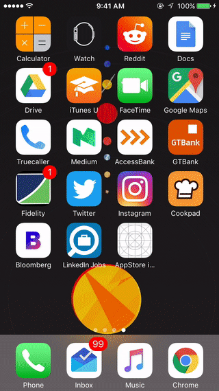
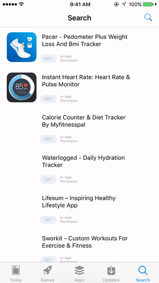

# Appstore iOS 11
So I was following Brian Voong's Appstore videos on letsbuildthatapp.com and I decided to turn things up a notch.. and this came about. Found the designs on dribble! I guess there's just a whole lot of dope stuff online... Basically a rough draft of the appstore freebie by Felix Lebedinzew (http://felix-lebedinzew.com/), The app store data is from apptweak.io , they have an awesome API.. I mean there's everything in their JSON responses. I learnt (the hard way) quite a lot about navigation controllers and how they work with the navigation bar, tab bars etc.

## Installation
- `git clone https://github.com/aliumujib/AppStoreiOS11`
- `open AppStoreiOS11/AppStoreiOS11.xcworkspace`
- go to https://apptweak.io
- Register and obtain an API key.
- Paste the API in the API_KEY constant in Constants.swift
- open terminal `cd` to the directory and run `pod install`
- open Xcode <kbd>COMMAND</kbd> + <kbd>R</kbd>

## Technology Stack
- Apptweak.io
- UIKit

## Used libraries
- **LBTAComponents** - library by letsbuildthatapp.com for easy UICollectionViewController management and view layouts amongst other things...
- **Kingfisher** - Popular image loader ...we all know this guy
- **Alamofire** - For handling network requests
- **ReadMoreTextView** - For showing collapsible text
- **AZSearchView** - Nice searchview controller...

## To do
- **1.** Split a lot of the files, some long .swift files exist in this project
- **2.** Read up on writing better animations
- **3.** Better error handling

License
----------------

The MIT License (MIT)

Copyright (c) 2017 Aliu Abdul-Mujib

Permission is hereby granted, free of charge, to any person obtaining a copy
of this software and associated documentation files (the "Software"), to deal
in the Software without restriction, including without limitation the rights
to use, copy, modify, merge, publish, distribute, sublicense, and/or sell
copies of the Software, and to permit persons to whom the Software is
furnished to do so, subject to the following conditions:

The above copyright notice and this permission notice shall be included in all
copies or substantial portions of the Software.

THE SOFTWARE IS PROVIDED "AS IS", WITHOUT WARRANTY OF ANY KIND, EXPRESS OR
IMPLIED, INCLUDING BUT NOT LIMITED TO THE WARRANTIES OF MERCHANTABILITY,
FITNESS FOR A PARTICULAR PURPOSE AND NONINFRINGEMENT. IN NO EVENT SHALL THE
AUTHORS OR COPYRIGHT HOLDERS BE LIABLE FOR ANY CLAIM, DAMAGES OR OTHER
LIABILITY, WHETHER IN AN ACTION OF CONTRACT, TORT OR OTHERWISE, ARISING FROM,
OUT OF OR IN CONNECTION WITH THE SOFTWARE OR THE USE OR OTHER DEALINGS IN THE
SOFTWARE.
